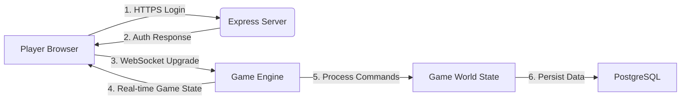

# Game Plan - Kingdoms of Avarice

Kingdoms of Avarice will be a web based game that mimics old style Telnet MUDs. Specifically it will emulate the style and feel of the game MajorMUD.

## Goals

- Create a game that is similar to MajorMUD
- Use modern web technologies
- Make it easy to develop and maintain
- Make it easy to play
- Make it easy to expand

## Architecture

### Project Structure (Monorepo)

```
/packages
  /shared    # Shared types, constants, command definitions
  /client    # Vite + xterm.js
  /server    # Node.js + Express + WebSocket
```

This structure allows shared TypeScript types between frontend and backend, preventing type drift.

### Frontend

- xterm.js for terminal emulation
- Vite for build tooling
- TypeScript for type safety

### Backend

- Node.js + TypeScript
- WebSockets (`ws` library) for real-time communication
- Express for login authentication / HTTP routes
- State Management will be in-memory for now, and sync to database when needed
- ANSI color utility for formatting terminal output

### Authentication

- JWT stored in HTTP-only cookie (prevents XSS attacks)
- WebSocket upgrade validates JWT from cookie
- bcrypt for password hashing

### Database

- PostgreSQL

### Initial Database Schema

```sql
-- Players table (account level)
CREATE TABLE players (
    id SERIAL PRIMARY KEY,
    username VARCHAR(50) UNIQUE NOT NULL,
    password_hash VARCHAR(255) NOT NULL,
    email VARCHAR(255) UNIQUE,
    created_at TIMESTAMP DEFAULT CURRENT_TIMESTAMP,
    last_login TIMESTAMP
);

-- Characters table (one player can have multiple characters)
CREATE TABLE characters (
    id SERIAL PRIMARY KEY,
    player_id INTEGER REFERENCES players(id),
    name VARCHAR(50) UNIQUE NOT NULL,
    race VARCHAR(50) NOT NULL,
    class VARCHAR(50) NOT NULL,
    level INTEGER DEFAULT 1,
    experience INTEGER DEFAULT 0,
    health INTEGER NOT NULL,
    max_health INTEGER NOT NULL,
    mana INTEGER DEFAULT 0,
    max_mana INTEGER DEFAULT 0,
    strength INTEGER NOT NULL,
    intelligence INTEGER NOT NULL,
    dexterity INTEGER NOT NULL,
    constitution INTEGER NOT NULL,
    current_room_id INTEGER,
    gold INTEGER DEFAULT 0,
    created_at TIMESTAMP DEFAULT CURRENT_TIMESTAMP
);

-- Rooms table
CREATE TABLE rooms (
    id SERIAL PRIMARY KEY,
    name VARCHAR(100) NOT NULL,
    description TEXT,
    area VARCHAR(100)
);

-- Room exits
CREATE TABLE room_exits (
    id SERIAL PRIMARY KEY,
    from_room_id INTEGER REFERENCES rooms(id),
    to_room_id INTEGER REFERENCES rooms(id),
    direction VARCHAR(20) NOT NULL
);

-- Items table
CREATE TABLE items (
    id SERIAL PRIMARY KEY,
    name VARCHAR(100) NOT NULL,
    description TEXT,
    item_type VARCHAR(50),
    weight INTEGER DEFAULT 0,
    value INTEGER DEFAULT 0
);

-- Character inventory
CREATE TABLE character_inventory (
    id SERIAL PRIMARY KEY,
    character_id INTEGER REFERENCES characters(id),
    item_id INTEGER REFERENCES items(id),
    quantity INTEGER DEFAULT 1,
    equipped BOOLEAN DEFAULT FALSE
);

-- NPCs table
CREATE TABLE npcs (
    id SERIAL PRIMARY KEY,
    name VARCHAR(100) NOT NULL,
    description TEXT,
    room_id INTEGER REFERENCES rooms(id),
    health INTEGER,
    max_health INTEGER,
    hostile BOOLEAN DEFAULT FALSE,
    respawn_time INTEGER
);
```

### **The Architecture: How It All Fits Together**



## Step by Step Setup

1. **Setup:**
   - Initialize monorepo structure with `/packages/shared`, `/packages/client`, `/packages/server`
   - Create a Vite + TypeScript project for the frontend (`/packages/client`)
   - Create a Node.js project for the backend using ts-node-dev for hot-reload (`/packages/server`)
   - Set up shared types package (`/packages/shared`)
   - Install dependencies:
     - **Server:** `ws`, `express`, `pg`, `bcrypt`, `jsonwebtoken`, `cookie-parser`
     - **Client:** `xterm`, `xterm-addon-fit`
2. **Frontend:**
   - Build a login form (HTTP POST to backend)
   - On login success, initialize xterm.js, connect to '/game' WebSocket endpoint.
   - Wire xterm's input to send WebSocket messages. Wire incoming WebSocket messages to xterm's 'write()'
3. **Backend:**
   - Set up Express for `/login` (verify credentials against DB, return JWT/session).
   - Create a WebSocket server (`ws`) listening on a path (e.g., `/game`).
   - On connection:
     - Authenticate (validate JWT/session from cookie).
     - Add player to the in-memory game state (with a unique ID).
     - Send initial room description.
   - On message: Parse command, update in-memory state, broadcast results to relevant players.
   - Implement basic `go`, `look`, `say` commands.
4. **Persistence:**
   - Set up PostgreSQL with initial schema (see above).
   - Store player credentials (bcrypt hashed passwords).
   - Persist critical player data (location, inventory, stats) on login, logout, or periodic intervals.
5. **Character Creation:**
   - Implement race selection (Human, Elf, Dwarf, etc.)
   - Implement class selection (Warrior, Mage, Rogue, etc.)
   - Stat rolling/allocation system
   - Store new character in database
6. **Game World:**
   - Design your map (rooms, exits, items, NPCs) as in-memory data structures (arrays/objects).
   - Implement ANSI color utility for formatted output.
   - Implement core game logic (movement, combat, item use).
